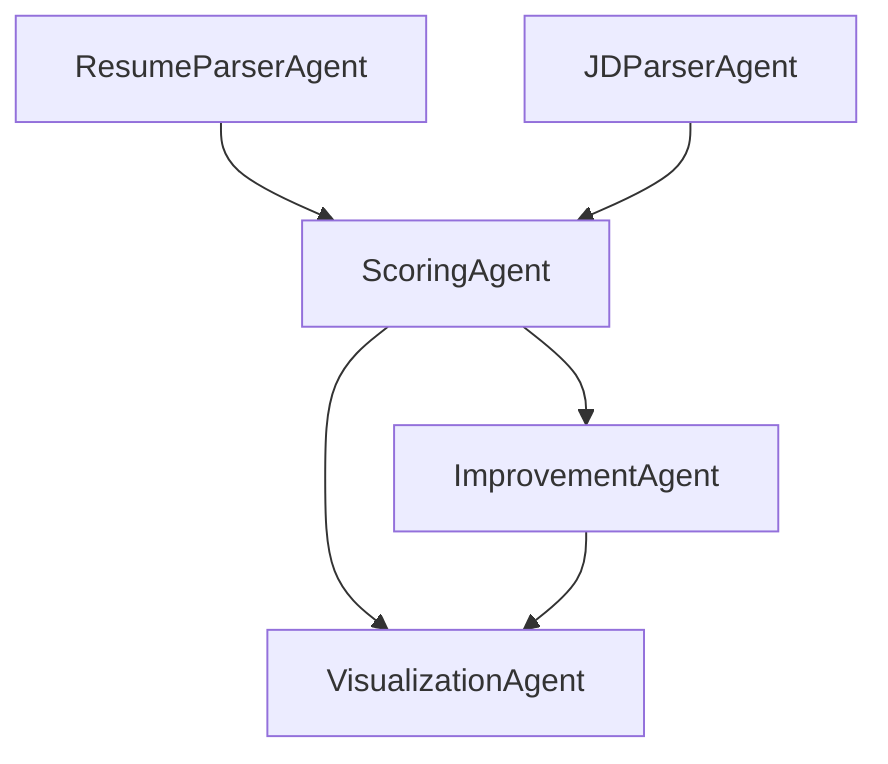

# 🧠 ATS Agentic Workflow with AutoGen GraphFlow

This project implements an **Agentic Applicant Tracking System (ATS)** using [AutoGen v0.7.2](https://microsoft.github.io/autogen/stable/) and its new `GraphFlow` orchestration engine. It models resume and job description analysis as a directed acyclic graph (DAG) of AI agents, enabling parallel processing, structured reasoning, and scalable workflows.

---

## 🚀 Features

- 🧾 Resume and Job Description parsing via dedicated agents
- 📊 Candidate scoring based on skill match
- 🛠️ Resume improvement suggestions
- 📈 Visualization of candidate fit
- 🔁 Modular DAG orchestration using `GraphFlow`
- 📂 File-based input support (e.g., PDF resumes)

---

## 🧱 Architecture

